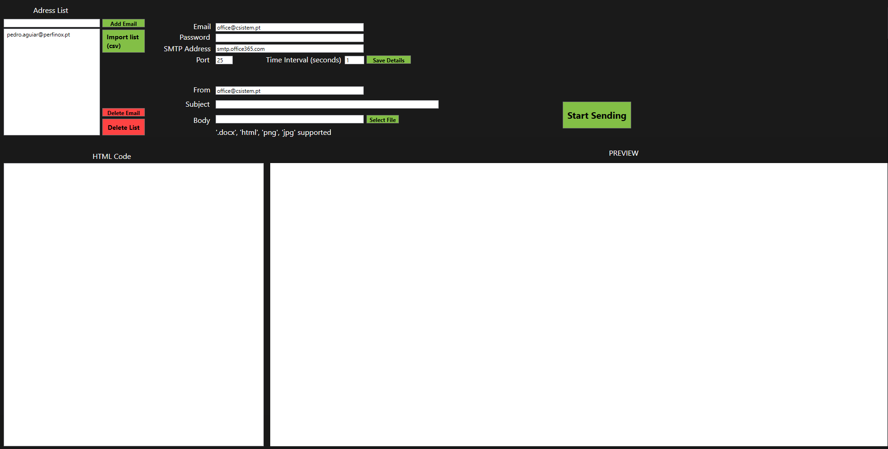
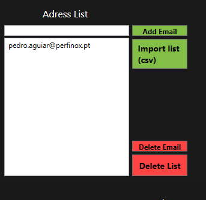
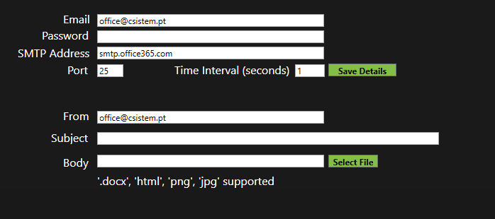
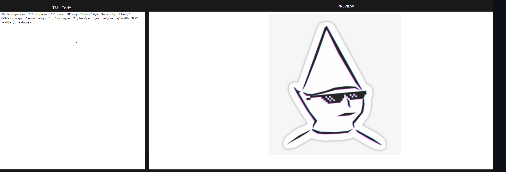

# Mailing_List_App
WPF windows app, made with C# and XAML for mass email sending, good for newsletters and such

  

Functions:
- Import .csv file comprised of a list of emails (single column)
- Add/delete individual emails from said list

  

- Save the SMTP details for future usage (except for the password for security purposes, but you can change that)
- Set the time between each email sent (to prevent being detected as spam, the larger the list use a larger time gap)

  

- Import an image file or Word, it will do the conversion to HTML paste it on the left box and preview on right one
- Live preview of HTML editing with it

  

